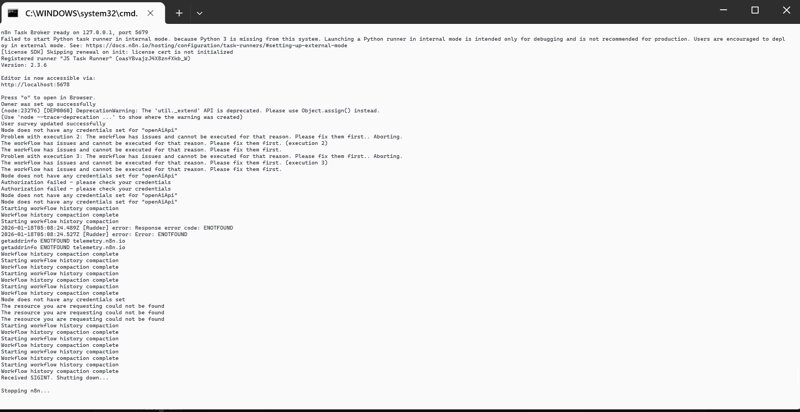
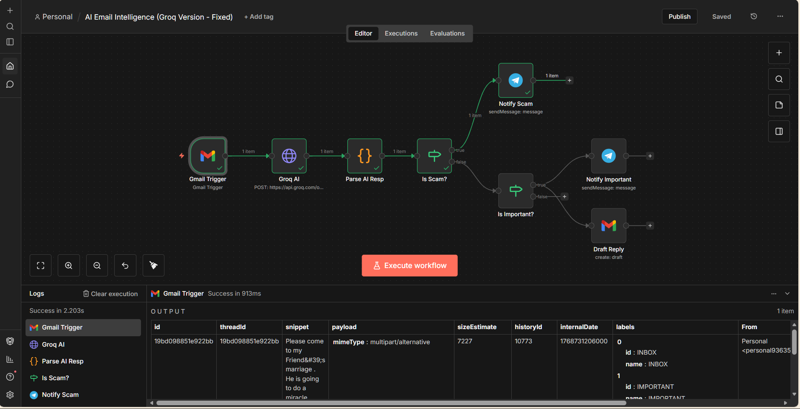
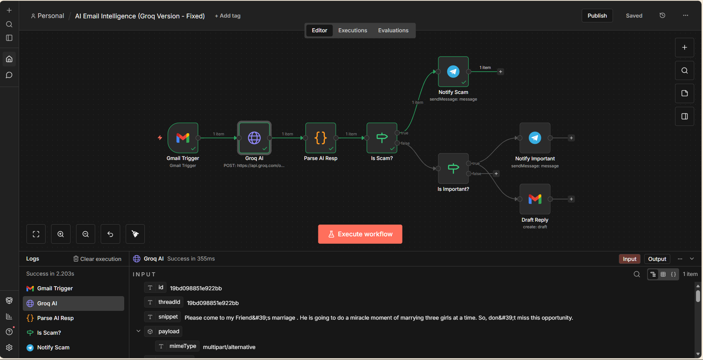
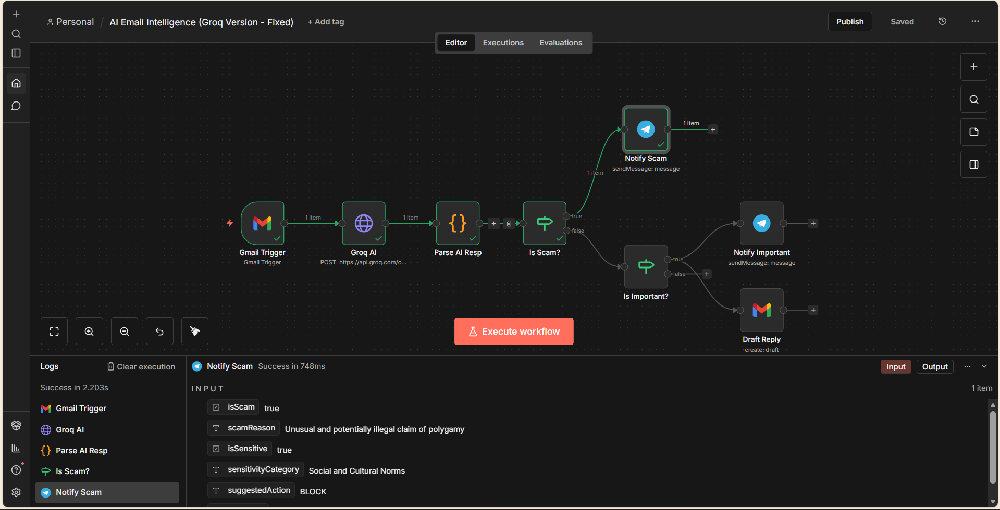
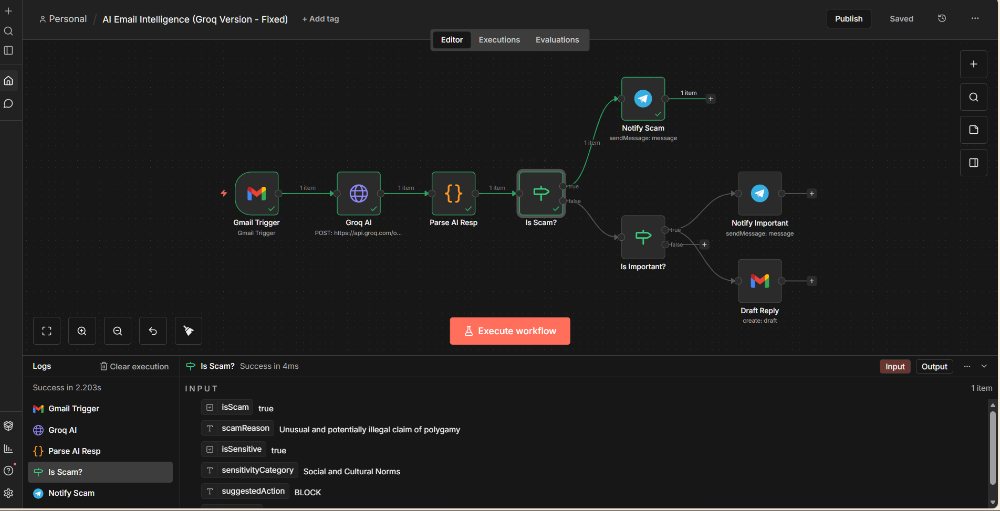
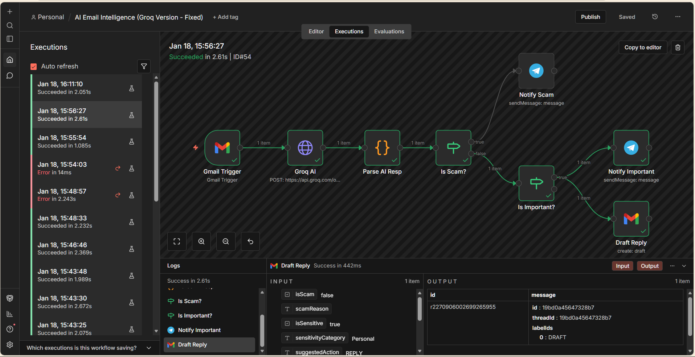
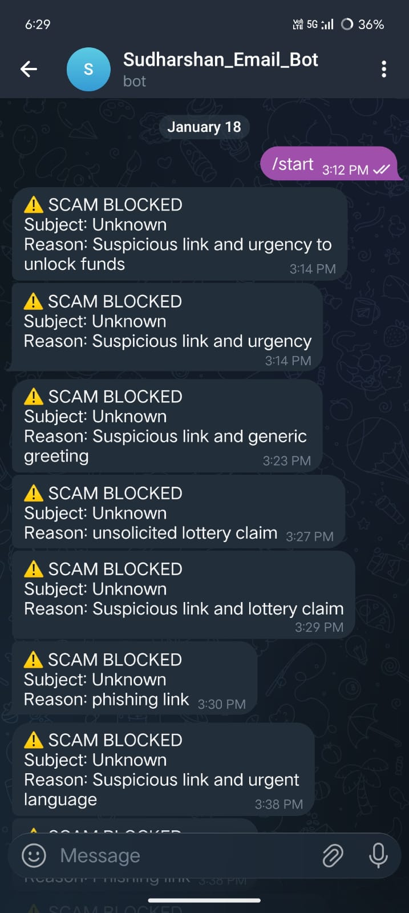
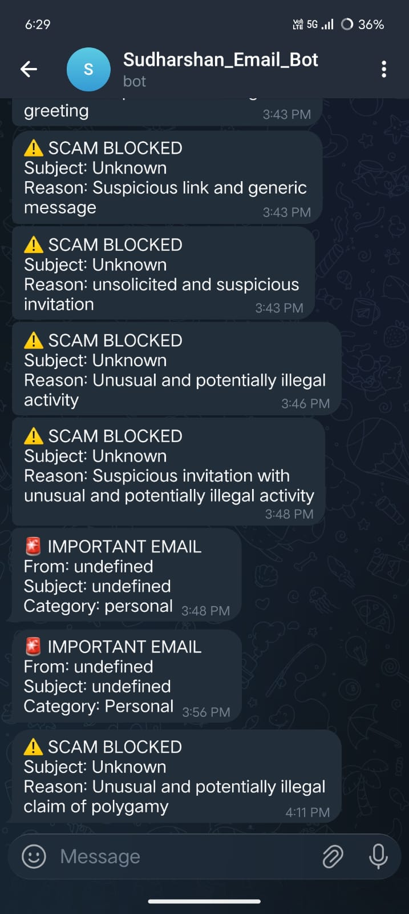
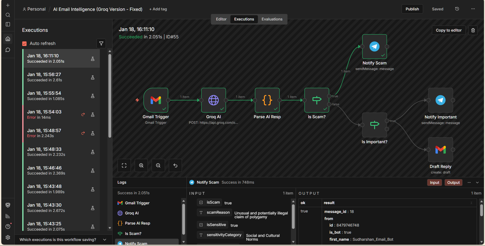

# 🛡️ AI-Powered Email Intelligence Agent

This project is an automated AI system built with **n8n** that scans your incoming Gmail messages, detects scams/fraud, identifies high-priority emails, and drafts professional replies—all in real-time.

---

## **📂 Project Structure**
- `email_intelligence_workflow.json`: The final working n8n workflow file.
- `prompts.md`: The system prompt used for the AI analysis.
- `dashboard.html`: A mock visualization of the agent's work.

---

## **🚀 Setup Instructions**

### **Step 0: Terminal / Command Shell (Installing n8n)**
If you are running n8n locally on your own computer, follow these steps:
1. Open your **Command Prompt** or **PowerShell**.
2. Navigate to this project folder:
   ```powershell
   cd "C:\Users\sudharshan\.gemini\antigravity\scratch\email-intelligence-agent"
   ```
3. Start n8n using `npx`:
   ```powershell
   npx -y n8n start
   ```
4. **Wait** until you see: `Editor is now accessible via: http://localhost:5678`.
5. Keep this terminal window **open** while using the agent.



---

### **Step 1: Google Cloud (Gmail API)**
1. Go to [Google Cloud Console](https://console.cloud.google.com/).
2. Create a project and enable the **Gmail API**.
3. Create **OAuth client ID** for "Web application".
4. **Authorized redirect URI**: `http://localhost:5678/rest/oauth2-credential/callback`.

### **Step 2: Telegram Bot (Alerts)**
1. Search for **@BotFather** on Telegram.
2. Send `/newbot` and follow instructions to get your **Bot Token**.
3. Search for **@userinfobot** to get your numeric **Chat ID**.

### **Step 3: Groq AI (The Brain)**
1. Go to [Groq Console](https://console.groq.com/).
2. Generate an API Key (starts with `gsk_...`).

---

## **🛠️ n8n Configuration**

1. **Import**: Open n8n, go to "Import from File", and select `email_intelligence_workflow.json`.



2. **Configure Credentials**:
   - **Gmail**: Paste your Google Client ID & Secret.
   - **Groq AI (Header Auth)**: Set `Authorization` header to `Bearer <YOUR_GROQ_KEY>`.
   - **Telegram**: Paste your Bot Token and numeric Chat ID.




3. **Check Logic**:
   - Verify the **Scam Detection** and **Priority** logic nodes.




4. **Activation**:
   - Ensure the lightning bolt ⚡ is on the Gmail Trigger and toggle the **Active** switch to **ON**.

---

## **💡 How it Works**

- **Scams**: If an email is flagged as fraud, it is blocked, and you get an IMMEDIATE warning on Telegram.



- **Important**: If the email is from a client or HR, you get a priority alert on Telegram.



- **Auto-Draft**: For legitimate emails, a "Re: ..." draft is created in your Gmail.

### **Monitoring**
You can view the execution logs in n8n to see the agent in action.



---
*Created with ❤️ for smart inbox management.*
